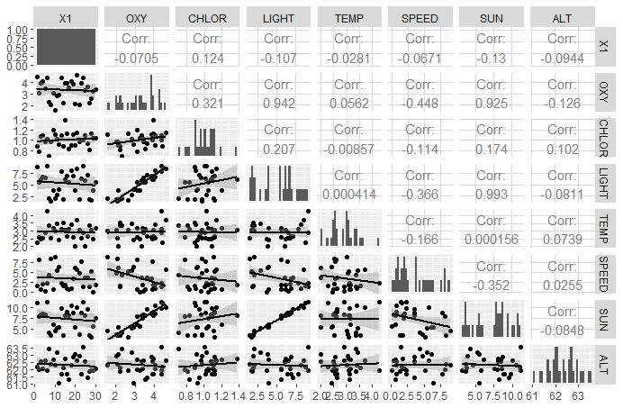

# ADSSM_2

author : Ziliang Zhou    Student Number: 690052545

## a. exploratory data analysis

Explore the relationship in explanatory variables and production of oxygen.

* Using the scatter plot explore the relationship.

  

This plot shows the **Sun**, **chlorophyll** and **Light** has significant positive influence of oxygen production. The **Speed** have little negative influence of oxygen production. There are not obverse influence in other variable. 

And it also shows the **Sun** and **Light** have highly positive relationship.


## b. build a model

​	Based on problem **a **, I build a liner module about oxygen production. Because of variable **Sun** and **light** have liner relationship, I only choose variable **Sun** in my model.
$$
OXY = \beta_0 + \beta_1*Sun + \beta_2*Chlor + \beta_3*Speed
$$

​	Getting a result by Using R to calculate the module. 
​	The model is :
$$
OXY = 0.30 + Chlor + o.29Sun - 0.04Speed
$$


## c. report

​	In my model, I choose three variable to explain the oxygen production. Using liner regression to estimate how the oxygen production been influenced by this variable.
​	Using the summary we can see the p value and R-square of each variation. Both **Chlor** **Speed** and **Sun** have p-value < 0.05. And the $R^2$ of 89.7% and adjusted $R^2$ of 89.5% tells us, this model explains more than 80% of oxygen production.

| null | Estimate | Std. Error | t value | pr($>|t|$ ) |
| ---- | -------- | ---------- | ------- | ------- |-------|
|(Intercept) |  0.29928470 | 0.44856462|0.6672053|5.105197e-01|
|CHLOR | 1.01056089 | 0.41052946|2.4616038|2.078154e-02|
|SUN | 0.29406027 | 0.02351310|12.5062309|1.668315e-12|
|SPEED | -0.04252365 | 0.02210901|-1.9233633|6.545000e-02|

​	I did not choose the Light as a explanatory variables, because it has significant relationship with Sun, if I add it to my model, the model will become incorrect. Using chisq.test their p-value is 0.2372, smaller than o.8. 

​	Other two factor **Temp** and **ALT** was not choose by me. We can build another model to exam the relationship with **Oxy**. R shows the adjust $R^2$ of **Temp** is -0.03 and of **Alt** is -0.02. That means neither of this two variables can explain the oxygen production

## Appendix

a.

```R
library(tidyverse)
library(GGally)
oxygenfull <- read_csv("oxygenfull.csv")
ggpairs(oxygenfull,
        lower = list(continuous = "smooth"),
        diag=list(continuous="barDiag"),
        axisLabels='show')
```

b.

```R
mod_1 <- lm(formula = OXY ~ 1 + CHLOR + SUN + SPEED,data = oxygenfull)
result <- summary(mod_1)
```

c.

```R
#exam whether the light and sun are independent or not.
chisq.test(oxygenfull$LIGHT,oxygenfull$SUN)

mod_2 <-lm(formula = OXY ~ TEMP,data = oxygenfull)
mod_3 <-lm(formula = OXY ~ ALT, data = oxygenfull)
summary(mod_2)$adj.r.squared
summary(mod_3)$adj.r.squared
```

